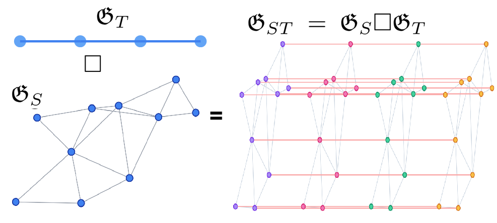
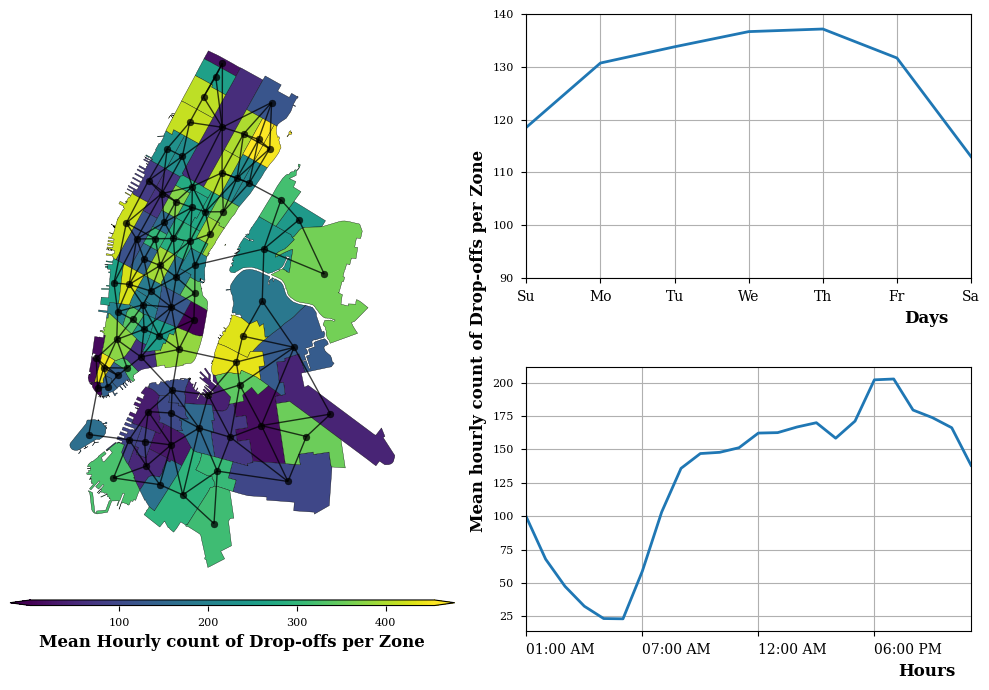

# Higher-order Grouped Outlier Robust PCA
This repository organizes the Higher-order Grouped Outlier Robust Principal Component Analysis (HoGORPCA) model implementations and anomaly detection experiments performed in the related publications. Proposed domain topology aware robust tensor decomposition models, under the $\mathrm{[SNN]-[LOGN+GTV]}$ umbrella incorporates the structure of the spatial, temporal domains into the tensor decomposition with graphs, and enhances the tensor decompositions' performance for detection of grouped (spatially or temporally) outliers. We use two structured sparsity promoting penalties, namely Latent Overlapping Grouped Norms and Graph Total Variation defined through a graph, extending the naive Lasso $\ell_1$ penalty used in Robust Tensor Decomposition frameworks.

    <figure>
        
        <strong>(a)</strong> Example illustration of a spatial proximity graph and temporal line graph connecting consecutive time points $\mathfrak{G}_S, \mathfrak{G}_T$ along with their product graph $\mathfrak{G}_ST$
    </figure>
    <figure>
        
            <strong>(b)</strong> Spatial Graph representing adjacency between 81 taxi zones in NYC and mean hourly drop-offs statistics accross Zones, Hours and Days.
    </figure>

  <strong>Figure 1:</strong> Main caption describing both subfigures.

## Model Implementations
The implementations of the Higher-Order Grouped Outlier Robust PCA models can be found in `./src/models/lr_ssd/` folders. Within this folder,
- `snn__logn_gtv.py` contains $\mathrm{[SNN]-[LOGN+GTV]}$ model implementation
- `snn_logs.py` contains $\mathrm{[SNN]-[LOGN]}$ model implementation.

The Singleton implementation of Higher-order Robust PCA ($\mathrm{HoRPCA}$) model can be found in `./src/models/horpca/horpca_torch.py`

> :memo: **Note:** $\mathrm{[SNN]+[LOGN+GTV]}$ can be considered a generalization of $\mathrm{[SNN]-[LOGN]}$ and $\mathrm{HoRPCA}$ algorithms. Consequently, $\mathrm{[SNN]+[LOGN+GTV]}$ model with the hyper-parameters and groupings are chosen accordingly specializes to $\mathrm{HoRPCA}$ and $\mathrm{[SNN]-[LOGN]}$. We often called on the $\mathrm{[SNN]+[LOGN+GTV]}$ implementation with the corresponding settings for convenience instead of calling the implementations in `snn_logs.py` or `horpca_torch.py`.

I intend to upload more user friendly versions of these implementations in my `t-regs` repository.

## Experiment Results and Setup
Example applications, experiment and experiment processes can be found in `./experiment_board/` folder for the publications [1,2] under the following structre:

1. Higher-order Grouped Outlier Robust PCA with Graph Total Variation (SIGPRO)
    1. Synthetic Experiments:
        The details of the experiment, the hyper-parameter selection scripts and the results can be found in `./experiment_board/anomaly_detection_synthetic_exps/`.
    2. NYC Event Detection and SMD Anomaly Detection Experiments:
        Dataset loader python scripts and classes can be found in `./data/nyc_taxi_dataset.py` and `./data/server_machine_dataset.py` folders.
        Dataset pre-processing steps and experiment scripts along with the results can be found in `./experiment_board/anomaly_detection_real_data_exps/`. Specifically, `./experiment_board/anomaly_detection_real_data_exps/smd_and_nyc_pipeline.ipynb` holds the crucial data processing and anomaly detection pipeline.
2. Higher-order Grouped Outlier Robust PCA [SSP_2025](https://ieeexplore.ieee.org/abstract/document/11073198 "Higher-Order Grouped Outlier Robust PCA for Spatio-temporal Anomaly Detection")
    The experiment scripts and the configurations can be found in `./experiment_board/lr_sparse_identifiability_exps/`. Please refer to the `README.md` file in the folder. The synthetic experiment results for this publication are also organized in [Experiment report](https://api.wandb.ai/links/indibi_at_splab_msu/0z451h52)

## References

- [SIGPRO]: Indibi, M., Aviyente, S. (2025). “Spatio-temporal Anomaly Detection: A Regularized Robust Tensor Decomposition with Graph Total Variation and Grouped Sparsity”, Under revision at EURASIP Journal of Signal Processing
- [SSP_2025]: Indibi, M., & Aviyente, S. (2025, June). Higher-Order Grouped Outlier Robust PCA for Spatio-temporal Anomaly Detection. In 2025     IEEE Statistical Signal Processing Workshop (SSP) (pp. 176-180). IEEE.

## Contributors
Mert Indibi
